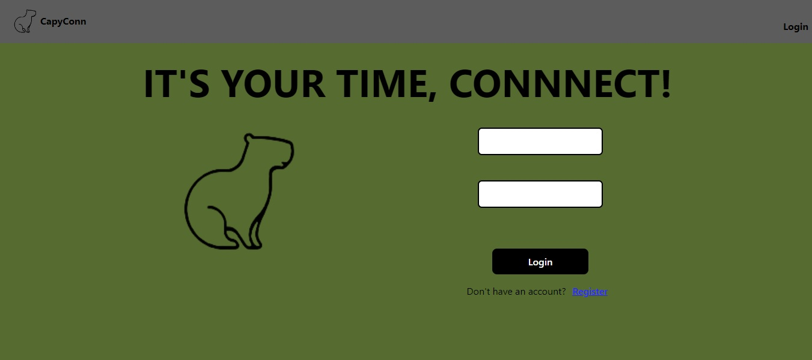
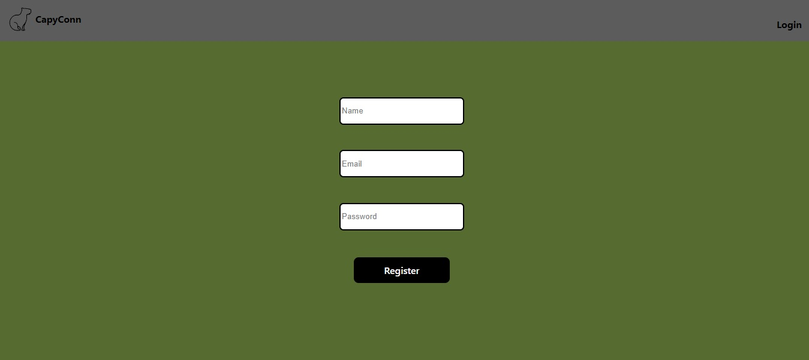
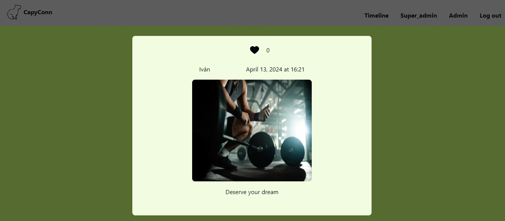
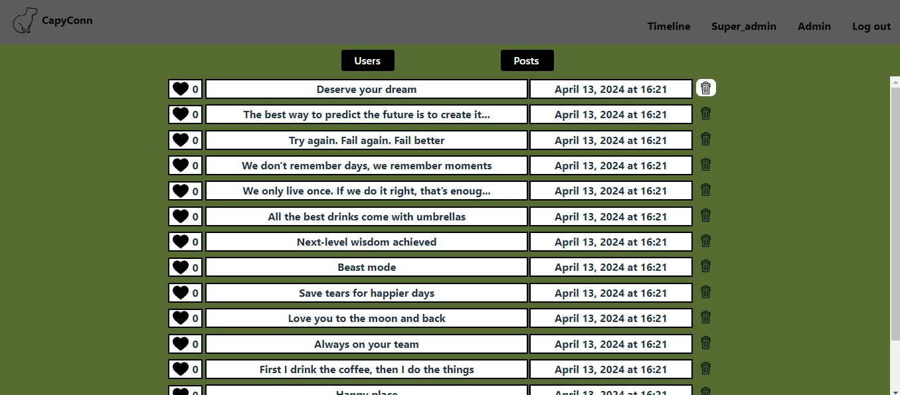

# Social network
Bienvenido a la documentación de la web de mi red social. Es mi septimo proyecto desarrollado en GeeksHubs Academy en el cual se ponen en práctica habilidades de desarrollo frontend con React.


## Tabla de contenido :page_with_curl:

- [Tecnologías.](#tecnologías-star2)
- [Características.](#características-label)
- [Instalación en local.](#instalación-en-local-gear)
- [Usuarios modelo](#usuarios-modelo-pouting_face)
- [Futuras funcionalidades.](#futuras-funcionalidadesrocket)
- [Autor.](#autor-curly_haired_man)
- [Agradecimientos.](#agradecimientos)

### Tecnologías :star2:

       


### Características	:label:
**Barra de navegación**


**6 vistas** a las cuales todo usuario tiene acceso excepto a la de Admin. Uso exclusivo para el administrador.

<details>

<summary>Login</summary>

- Desde donde podremos acceder al registro clicando sobre él.



</details>


<details>

<summary>Register</summary>



</details>


<details>

<summary>Timeline</summary>

- Encontramos todos los posts ordenador de más nuevo a más antiguo.


</details>

<details>
<summary> Post en detalle </summary>

- Desde Timeline al clicar cualquier post, nos llevará a esta vista donde podremos ver el post seleccionado con más detalles.




</details>


<details>
<summary>Profile</summary>

- Aparecerá indicado en la barra de navegación con el nombre que se registre cada usuario. En esta vista encontramos nuestro propios posts y nuestros datos de usuario, y podremos hacer diferentes acciones:


- Eliminar mis post


- Modificar nombre de usuario.


- Crear un nuevo post. Nos llevará a otra vista para crearlo.


</details>


<details>

<summary> Crear post </summary>

- Introduciremos una url de la imagen que queramos mostrar y una descripción.


</details>


<details>

<summary> Admin </summary>

- El administrador tendrá acceso a todos los usuarios registrados y sus posts, podrá eliminarlos si fuera necesario.

- Usuarios.


- Posts.



</details>


### Instalación en local :gear:

**1. Clonar el repositorio.**
````
$ git clone https://github.com/VictorBlasco5/Proyect-frontend-1


````
**2. Instalar las dependencias.**

````
$ npm install
````

**3. Poner en marcha el servidor.**
````
$ npm run dev
````

### Usuarios modelo :pouting_face:

#### User
````
Nombre: User
Email: user@user.com
Contraseña: Aa12345
````

#### Superadmin
````
Nombre: Super_admin
Email: superadmin@superadmin.com
Contraseña: Aa12345
````

### Proyecto deployado

https://master.d3czd04q4oh0gh.amplifyapp.com

### Futuras funcionalidades:rocket:

- Paginación en la vista admin para las tablas de posts y usuarios.
- Vista que muestre los posts a los que le he dado like.


### Autor :curly_haired_man:
- **Víctor Blasco** - Project Developer.

### Agradecimientos
- Agradecimiento a GeeksHubs Academy por su implicación en mi aprendizaje.
